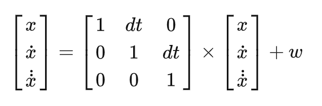

# Kalman-Filter
The Kalman Filter is a tool to estimate and predict system state (e.g., objective position) from error-existing measurements.

Good tutorials can be found at https://www.kalmanfilter.net/default.aspx or https://zhuanlan.zhihu.com/p/113685503


## Code
This repository provides two classes, KalmanFilter and KalmanFilter_Realtime. KalmanFilter is the traditional implementation with fixed sample time and starting position 0. In real-world engineering problems, it is possible that sample time varies and the starting position is not at 0. In KalmanFilter_Realtime, (1) Instead of fixed dynamic F, input F every time when predict(). (2) before the filter starts to call update(), initialize the starting position using change_x().

To use Kalman Filter classes, simply initialize a class, update() when measurements at new timestamps come, and predict() to get the predicted system state. I have used KalmanFilter_Realtime in my own vehicle-to-vehicle-communication-based control system.


## Parameters
F is the state-transition model.
 

B is the control-input model.

H is the observation model.

Q is the covariance of the process noise. The larger Q is, the less trustworthy the system estimation is.

R is the covariance of the observation noise. The larger R is, the less trustworthy the observation is.

P is the covariance of the current iteration noise. The larger P is, the less trustworthy the system estimation is.

see https://en.wikipedia.org/wiki/Kalman_filter for more.


## Have a try
```bash
python kalman-filter.py
```


